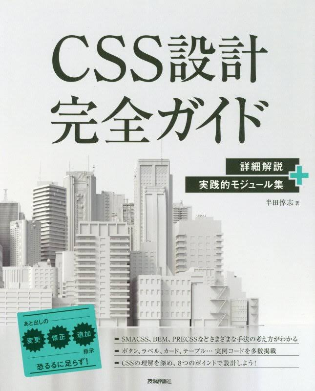

# CSS設計について

～よりよいコーディングライフのために～
<!--
_class: lead top
_header: ""
_footer: "by **@nSeino-coder**"
-->

---
# :one: はじめに
<!--
_class: lead
_header: ""
-->

---
## 今回話すこと
:book: **CSS設計完全ガイド　～詳細解説＋実践的モジュール集**
の内容を、以下の要点にまとめてお伝えします。
- CSS設計がなぜ必要なのか
- CSS設計とはなんなのか
- 有名な設計手法について

また、書籍のコードサンプルを参考に、
設計手法ごとにHTML/CSSを書いてみたものを紹介します。
<!--
header: "CSS設計について/1.はじめに"
-->

---
## 書籍について:book:

### CSS設計完全ガイド　～詳細解説＋実践的モジュール集

- 2020年2月27日紙版発売
- [書籍概要](https://gihyo.jp/book/2020/978-4-297-11173-1)
- [コードサンプル](https://css-architecture-perfect.guide/)

---
## 目次
1. はじめに　**←ｲﾏｺｺ**
2. CSS設計の必要性
3. CSS設計について
4. 設計手法3選
5. まとめ
6. さいごに

---
# :two: CSS設計の必要性
<!--
_class: lead
_header: ""
-->

---
## こんな経験ありませんか？
- 同じデザインなのにあっちもこっちも修正しないといけない
- CSSを修正したら意図していないパーツにも影響してしまった
- どこに適用されているのか分からない謎のスタイルがいる
- スタイルが上書きされすぎて`!important`せざるを得ない
- どんなクラス名をつけるべきか悩んでいたら夜が明けた

などなど…
<!--
header: "CSS設計について/2.CSS設計の必要性"
-->

---
## なぜこんなことが起こるのか
- ❝貧弱❞なCSSの問題
  - ページ数が増えるほど「カオス」な状態になる
  - すべてがグローバルスコープであるため、互いに干渉しやすい

- 複雑化するWeb開発
  - CMSなどで出力される変更不可能なHTML/CSS
  - 増加するページ数
  - 頻繁に変更される「状態」
<!-- //speaker note
本書では以下が挙げられています。

カオス：複雑、無秩序すぎて目も当てられない状態のこと。
なんの規則もなしに複数ページを書くとなると、CSSを編集したり追加してどこに影響するのか、見つけるのが難しくなる。
制作時はなんとかなっても、Webサイトには運用があります。カオスになったCSSを、数ヶ月後の自分、もしくは他の人が読み解いて、想定外の影響がないよう運用するのはとても骨が折れる作業です。
-->

---
## ↓↓↓
## CSS設計で解決しよう！
<!--
_class: lead sub
-->

---
# :three: CSS設計について
<!--
_class: lead
_header: ""
-->

---
## 個人でCSSを設計するのは難しい！
- 規則をきちんと整理できていないと、
  1人で開発するときですら記述がブレる

- ドキュメント化されていないと、
  他者と作業するときに記述がブレる

- 考えが甘すぎて、そもそも規則として機能していない

---
## 先人たちのおかげで生まれた❝CSS設計❞
- 2011年頃にNicolleSullivan氏が「**OOCSS**」を提唱し始めた
  ことがきっかけ

- その後「**BEM**」や「**SMACSS**」などのCSS設計手法が
  世界各国で開発され、広く使用された
<!-- //speaker note
ニコール・サリヴァン氏
-->

---
## どのCSS設計にも共通していること
- **抽象化すること**
  - 異なるスタイル間で共通するものは？
  - 共通する部分を切り出せないか？　などを考える

- **分けること**
  - ファイルを分ける
  - パーツの大きさで分ける
  - 役割に応じて名前を分ける
<!--
header: "CSS設計について/3.CSS設計について"
-->

---
## そもそも、よいCSSとは？
### よいCSS設計が目指す4つのゴール
GoogleのエンジニアPhilip Walton氏のブログ
「[CSS Architecture](https://philipwalton.com/articles/css-architecture/)」で提唱されている考え方。
- **予測できる**
- **再利用できる**
- **拡張できる**
- **保守できる**

---

- **予測できる**
  スタイリングが期待通りに動くか、
  その影響範囲が予測できる状態。

- **再利用できる**
  パーツを別の箇所で利用したとき、
  コードを修正する手間がない状態。

- **拡張できる**
  追加・更新・配置換えをしたとき、
  既存のCSSをリファクタリングする必要がない状態。

- **保守できる**
  CSSに携わる人が複数人であっても、問題なく管理できる状態。

---
## ↓↓↓
## どうやって実現させればいいの？？
<!--
_class: lead sub
-->
<!-- //speaker note
なんの指標もなしに工夫するのは大変！
上記の4つのゴールを実現するために本書では8つのルールがあげられています。
-->

---
## CSS設計に共通する8つのポイント

1. 特性に応じてCSSを分類する
2. コンテンツとスタイリングが疎結合である
3. 影響範囲がみだりに広すぎない
4. 特定のコンテキストにみだりに依存していない
5. 詳細度がみだりに高くない
6. クラス名から影響範囲が想像できる
7. クラス名から見た目・機能・役割が想像できる
8. 拡張しやすい
<!-- //speaker note
設計手法の紹介とともに、どのルールに該当するのかが提示されていてわかりやすいです。
-->

---
# :four: 設計手法の紹介（3選）
<!--
_class: lead
_header: ""
-->

---
## 有名な3つの設計手法
- OOCSS
  - [http://oocss.org/](http://oocss.org/)

- SMACSS
  - [http://smacss.com/ja](http://smacss.com/ja)

- BEM
  - [https://en.bem.info/](https://en.bem.info/)
<!--
header: "CSS設計について/4.設計手法の紹介（3選）"
-->
<!-- //speaker note
紹介する設計手法と、その公式ドキュメント一覧。
-->

---
## OOCSS（Object-Oriented CSS）
- **提唱された発想**
  - レゴのように組み合わせ自由なモジュールの集まりを作ろう
  - そのモジュールの組み合わせでページを作成しよう
  - 新規ページを作るときも、基本的に追加のCSSは必要ない

- **原則**
  - ストラクチャーとスキンの分離
  - コンテナとコンテンツの分離
<!-- //speaker note
日本語訳：オブジェクト指向CSS
解説はかなり簡素で、明確に規則と呼べるものも多くない。
他の設計手法も、基本的にOOCSSを参考にしつつ改良が加えられたもの。CSS設計の基礎中の基礎であると本書では言っている。
-->

---
### ストラクチャー（構造）とスキン（見た目）の分離
- ストラクチャー： `width`/`height`/`padding`/`margin` など
- スキン： `color`/`font`/`background`/`box-shadow` など
### コンテナとコンテンツの分離
- コンテナ： ヘッダー・セクションなど（エリア）
- コンテンツ： カードやボタンモジュールなど
<!-- //speaker note
モジュールをなるべく特定のエリアに依存させない！
-->

---
## SMACSS（Scalable and Modular Architecture for CSS）

- CSSを5つのカテゴリに分類して管理
  - Base … 要素そのもののデフォルトスタイル
  - Layout … ページをエリアごとに分割
  - Module … 再利用可能なパーツ
  - State … レイアウトやモジュールの特定の状態を示す
  - Theme … サイトのルック＆フィールを定義
<!-- //speaker note
日本語訳：拡張可能かつモジュール的なCSS設計。
OOCSSがほぼモジュールのみにしか言及していないのに対し、SMACSSはベースやレイアウトの扱い方にまで言及している。
-->

---
## BEM
- **Block** … 論理的かつ機能的に独立したモジュール
  ※レイアウトに関するスタイリング
  （position/float/marginなど）をしてはいけない。

- **Element** … Blockの子要素
  ※Blockの外では独立して使用できない

- **Modifier** … BlockやElementの装飾や動作のパターン

- 詳細度を均一に保つため、要素・IDセレクタは推奨されない
<!-- //speaker note
OOCSSのようにモジュールをベースにした方法論であるものの、他の設計手法に比べて厳格・強力。
Blockは特定のコンテキストに依存していない、どこでも使い回せるパーツ。基本的に、レイアウトに関するスタイリング（position/float/marginなど）をしてはいけない。
-->

---
## 他にも…
- PRECSS
- MCSS
- FLOCSS 　など

---
## 各設計手法で書いてみた
- OOCSS
  http://sample.com/OOCSS/

- SMACSS
  http://sample.com/SMACSS/

- BEM
  http://sample.com/BEM/

---
# :five: まとめ
<!--
_class: lead
_header: ""
-->

---
## 書き比べてみた感想
<!--
header: "CSS設計について/5.まとめ"
-->

---
## 設計はよいもの！

- 設計手法を理解して利用することで、結果的に作業の効率化につながる！
- UIの部品化などのコンポーネント思考は、CSS以外でも有用な考え方

---
# :six: おまけ
<!--
_class: lead
_header: ""
-->

---
## 今回のスライドについて

VSCodeの拡張機能[Marp for VS Code](https://marketplace.visualstudio.com/items?itemName=marp-team.marp-vscode)を使って、
Markdownで書きました！
マウス操作なしでサクサク便利:smile::pray::sparkles:
- 参考記事
  - [【VS Code + Marp】Markdownから爆速・自由自在なデザインで、プレゼンスライドを作る](https://qiita.com/tomo_makes/items/aafae4021986553ae1d8)
  - [【Marp】スライドをさっと作成して、CSSで自由にスタイルをあてたい](https://techblog.istyle.co.jp/archives/6356)
- お借りした背景素材：[Floral Drawings Slides](https://www.slidescarnival.com/ceres-free-presentation-template/1766)
<!--
header: "CSS設計について/6.おまけ"
-->

---
# ご清聴ありがとうございました:bow:
よいコーディングライフを！
<!--
_class: lead top
_header: ""
-->
